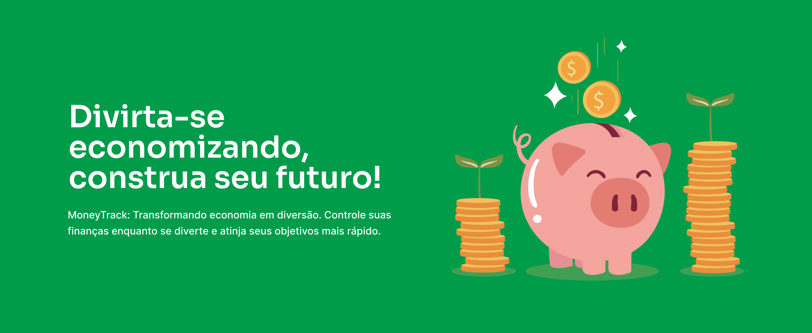
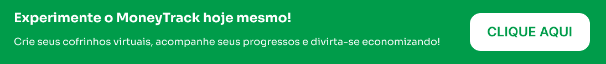

# MoneyTrack - Cofrinho Virtual! 🪙🐷



## Visão Geral 🌟

MoneyTrack é um cofrinho virtual inovador projetado para tornar o processo de economizar dinheiro mais divertido e eficiente. Com recursos de gamificação e um design intuitivo, o MoneyTrack permite que os usuários criem cofrinhos personalizados, acompanhem seus objetivos financeiros e conquistem suas metas de forma rápida e divertida.

Este repositório contém o código-fonte para o MVP (Produto Mínimo Viável) do MoneyTrack, que inclui as funcionalidades essenciais para o lançamento inicial do aplicativo.

## Funcionalidades Principais 🚀

- Criação de Cofrinhos Personalizados: Os usuários podem criar cofrinhos virtuais com nomes personalizados e definir metas financeiras.

- Depósito Inicial: Opção de fazer um depósito inicial no cofrinho para iniciar o processo de economia.

- Registro de Transações: Registro de depósitos e retiradas de dinheiro do cofrinho para acompanhamento do progresso.

- Validação de Dados: Verificação de dados para garantir que os valores inseridos sejam válidos.

- Interface Intuitiva: Design intuitivo e amigável para facilitar a navegação e uso do aplicativo.

<br>
<br>


<br>

## Rodando a aplicação (Frontend) 💻

```bash
# Clone este repositório para sua máquina usando HTTPS
$ git clone https://github.com/Fransuelton/money-track.git

# Ou, se preferir, clone usando SSH
$ git clone git@github.com:Fransuelton/money-track.git

# Navegue até a pasta do projeto no seu terminal ou prompt de comando
$ cd money-track

# Instale todas as dependências necessárias
$ npm install

# Agora, vamos iniciar a aplicação em modo de desenvolvimento
$ npm run dev

# E pronto! A aplicação estará disponível na porta 5173 - basta acessar http://localhost:5173 no seu navegador favorito
```

## Tecnologias Utilizadas 🛠️

O MoneyTrack foi desenvolvido utilizando as seguintes tecnologias:

- [React](https://reactjs.org/) - Uma biblioteca JavaScript para criar interfaces de usuário.
- [TypeScript](https://www.typescriptlang.org/) - Um superset tipado de JavaScript que compila para JavaScript puro.
- [Styled Components](https://styled-components.com/) - Uma biblioteca para estilizar componentes usando estilos escritos em JavaScript.
- [React Router](https://reactrouter.com/) - Uma biblioteca para roteamento de URLs no React.
- [Figma](https://www.figma.com/) - Uma ferramenta de design colaborativo para criar designs de interface de usuário, protótipos e muito mais.
- [Vite](https://vitejs.dev/) - Um construtor de aplicativos JavaScript moderno e rápido que funciona como um servidor de desenvolvimento com recarga rápida.
- [Vitest](https://vitest.dev/) - Em breve... 👀

<br>

- [](https://skillicons.dev)

## Próximos Passos 🌱

Este MVP é apenas o começo! Estamos comprometidos em continuar desenvolvendo o MoneyTrack e implementar novas funcionalidades emocionantes no futuro. Aqui estão alguns recursos planejados para as próximas versões:

- Implementação de gamificação avançada
- Integração com API de tradução de página
- Adição de mais opções de moedas para depósitos
- Melhorias na interface do usuário e experiência do usuário
- E muito mais!

## Feedback e Contribuição 🤝

Queremos ouvir sua opinião! Se você estiver utilizando o MVP do MoneyTrack e tiver alguma sugestão, feedback ou encontrar algum problema, por favor, nos avise preenchendo nosso formulário de feedback.

[Formulário de Feedback](link_para_formulario)

Além disso, se você estiver interessado em contribuir para o desenvolvimento do MoneyTrack, sinta-se à vontade para abrir uma issue ou enviar um pull request neste repositório. Valorizamos muito sua colaboração!

## Créditos 💡

Gostaría de dar os créditos aos seguintes recursos externos utilizados neste projeto:

- **storyset - Freepik**: [Logo de moeda](<[URL_da_imagem](https://br.freepik.com/vetores-gratis/ilustracao-do-conceito-de-cofrinho_13416121.htm#query=piggybank&position=17&from_view=search&track=sph&uuid=2092160f-7f4a-48b3-a715-ed67758524fe)>) 📸
- **Freepik**: [Imagem dashboard vazio](<[URL_da_fonte](https://www.freepik.com/free-vector/hand-drawn-bankruptcy-illustration-piggy-bank_7432344.htm)>) 📸
- **ClipartKey**: [Imagem principal](<[URL_da_fonte](https://www.clipartkey.com/view/hhwowT_coin-clipart-banking-piggy-bank/)>) 📸

## Licença 📜

O MoneyTrack é distribuído sob os termos da **Licença MIT**, Consulte o arquivo [LICENSE](link_para_arquivo_license) para obter mais informações.

## Agradecimentos ❤️

Obrigado por visitar o repositório do MoneyTrack! Espero que você tenha encontrado as informações que estava procurando e que esteja animado para experimentar nossa aplicação. Se tiver alguma dúvida, feedback ou sugestão, não hesite em entrar em contato. Sua contribuição é muito importante! 🚀

Obrigado mais uma vez e tenha um ótimo dia! 😊👋

<br>

[](https://money-track-cv.vercel.app/)
